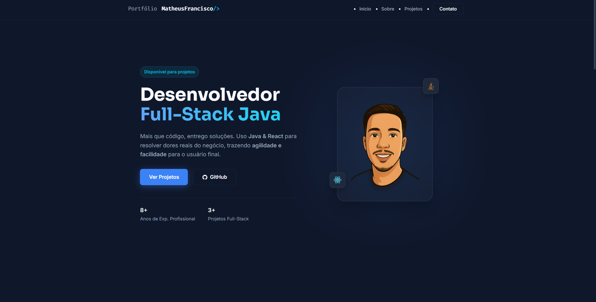

# Portfólio Pessoal — Matheus Francisco

Bem-vindo ao repositório do meu portfólio profissional. Este projeto foi desenvolvido para apresentar meus projetos, habilidades e trajetória como Desenvolvedor Full-Stack (Java & React).

🔗 **Acesse online:** [https://matheusfranciscols.github.io/](https://matheusfranciscols.github.io/)

 
*(Dica: Tire um print bonito do site pronto, salve como `preview.png` na pasta assets e essa imagem aparecerá aqui!)*

## 🛠 Tecnologias Utilizadas

* **HTML5 Semântico:** Estrutura e SEO otimizado.
* **CSS3 Moderno:** Flexbox, CSS Grid, Variáveis (Custom Properties) e Design Responsivo (Mobile First).
* **JavaScript (ES6+):** Manipulação de DOM, animações (Intersection Observer) e lógica de formulário.
* **Formspree:** Integração de formulário de contato funcional (Serverless).
* **Devicon:** Biblioteca de ícones para stacks tecnológicas.

## 🚀 Funcionalidades

* **Tema "Tech Pro Blue":** Identidade visual moderna e profissional.
* **Responsividade:** Layout adaptável para Celulares, Tablets e Desktops.
* **Animações Suaves:** Reveal on Scroll (elementos aparecem ao rolar).
* **Formulário Funcional:** Envio de e-mail direto sem backend complexo.
* **Links Inteligentes:** Botões para WhatsApp e cópia de e-mail.

## 📂 Como rodar localmente

1.  Clone o repositório:
    ```bash
    git clone [https://github.com/MatheusFranciscoLS/seu-repositorio.git](https://github.com/MatheusFranciscoLS/seu-repositorio.git)
    ```
2.  Abra o arquivo `index.html` no seu navegador.

---

Desenvolvido por **Matheus Francisco**.